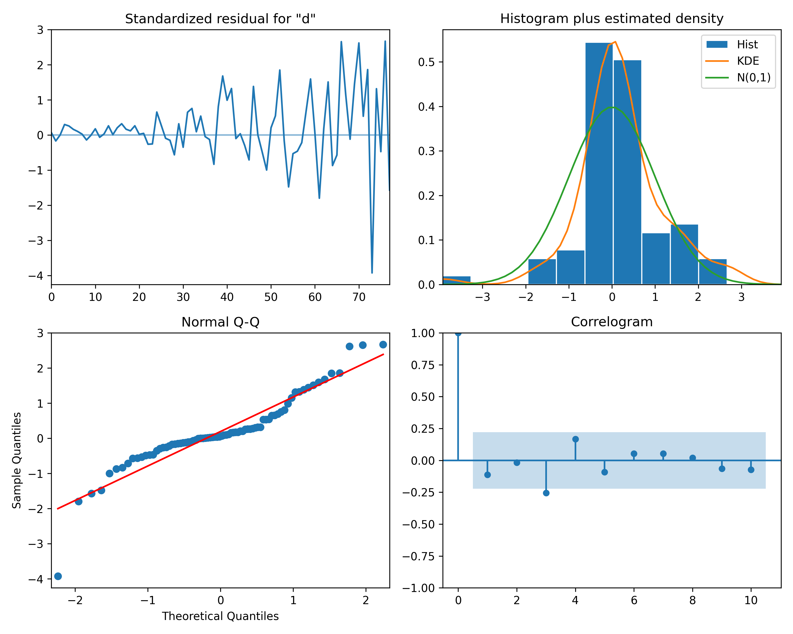
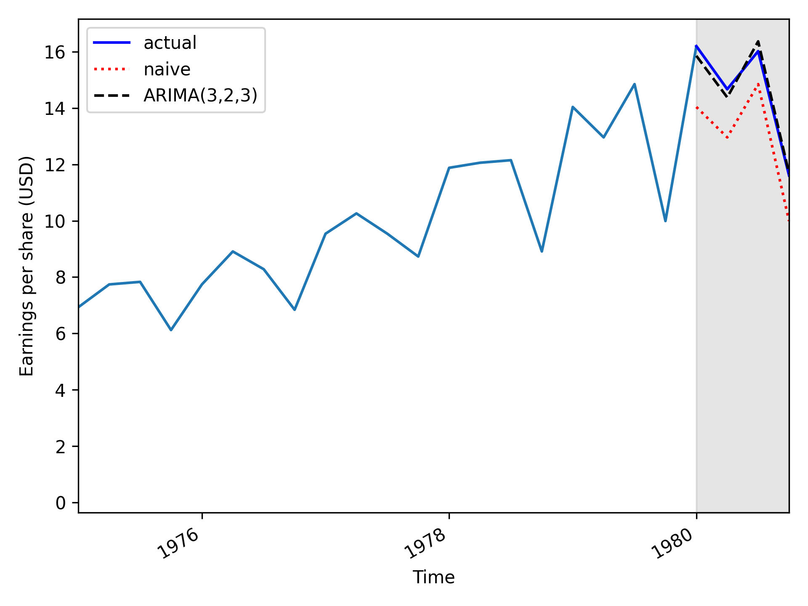

# Time series analysis

A made an ARIMA model to forecast earnings per share (USD) for the next year.

for Johnson and Johnson company.

I first made the Augmented Dickey-Fuller unit root test to check stationarity of the data and get the differencing term which is 2.

Then I fitted multiple arima models with p (lags) past values and q(lags) error terms. and compared them using the Akaike Information Criterion (AIC).

I chose the model with the lowest AIC which is the ARIMA(3,2,3).

Then I made a QQ Plot to analyze residuals from the model to make sure they look like white noise and uncorrelated.

Then I made the Ljung-Box test of autocorrelation in residuals to make sure there are no autocorrelation in residuals.

Once I was sure the model is a good fit for the data I made predictions.

The predictions are better than the baseline and they are made in non differentiated space as ARMA process.

This is the MAPE Mean Absolute Percentage Error:

- mape for naive: 11.561658552433654
- mape for ARIMA(3,2,3): 1.7216538736432183

