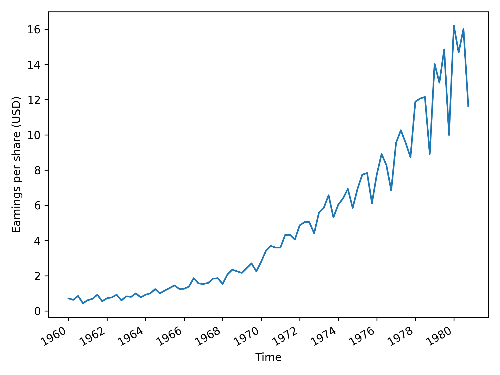

# Time series analysis

A made an ARIMA model to forecast earnings per share (USD) for the next year.

for Johnson and Johnson company.

I first made the Augmented Dickey-Fuller unit root test to check stationarity of the data and get the differencing term which is 2.

Then I fitted multiple arima models with p (lags) past values and q(lags) error terms. and compared them using the Akaike Information Criterion (AIC).

I chose the model with the lowest AIC which is the ARIMA(3,2,3).

